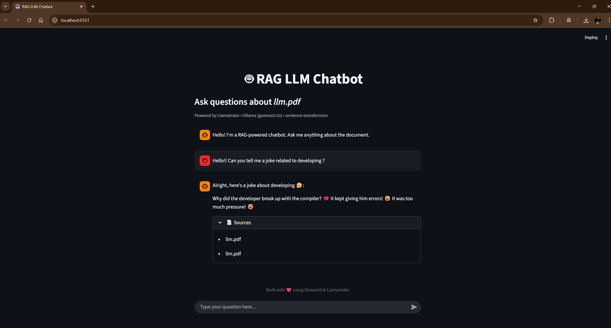

# RAG LLM Chatbot (Dad Joke Edition)

A Retrieval-Augmented Generation (RAG) chatbot built using Python that answers queries based on a provided PDF document.  
This project was developed as the **final project** during the **“LLM with Python” workshop at IIT Bombay Techfest**, with additional customization for personality and humor.

---

## Overview

This application demonstrates how unstructured text data stored in a PDF can be transformed into a searchable knowledge base using vector embeddings and queried using a local Large Language Model (LLM).

As an extension to the workshop project, the chatbot was customized to behave as a **dad-joke–only assistant**, showcasing prompt engineering and controlled generation.

---

## Features

- PDF-based knowledge retrieval (RAG pipeline)
- Semantic search using vector embeddings
- Local LLM inference (no external APIs required)
- Interactive chat interface built with Streamlit
- Controlled chatbot personality using prompt engineering

---

## Tech Stack

- Python  
- Streamlit  
- LlamaIndex  
- HuggingFace Sentence Transformers  
- Ollama  
- Gemma 3 (1B)

---

## Project Structure

```text
IITB_llm_with_python/
│
├── app.py
├── data/
│   └── llm.pdf
└── README.md
```
## How It Works (High Level)

1. Raw text data is stored inside a PDF file  
2. The PDF is loaded, split into chunks, and converted into vector embeddings  
3. Relevant chunks are retrieved using semantic similarity  
4. A local LLM generates responses grounded in the retrieved content  
5. Prompt engineering is used to enforce a specific chatbot personality  

---

## Getting Started

### Prerequisites

- Python 3.9 or higher  
- Ollama installed locally  

Pull the model:

```bash
ollama pull gemma3:1b
```
### Installation
```bash
pip install streamlit llama-index sentence-transformers
```
### Runnig the application
```bash
python -m streamlit run app.py
```
## Demo



The chatbot responds with dad jokes even for technical or serious prompts, demonstrating both retrieval-based grounding and behavior control.

---

## Workshop Context

This project was built during the **“LLM with Python” workshop at IIT Bombay Techfest**.  
The base RAG pipeline was provided as part of the workshop, and the project was extended by:

- Customizing the dataset  
- Adding prompt-based personality control  
- Improving the UI and interaction flow  

A certificate was awarded upon successful completion.

---

## Key Learnings

- Practical understanding of Retrieval-Augmented Generation  
- Working with vector embeddings for semantic search  
- Running LLMs locally without cloud APIs  
- Prompt engineering for controlled responses  
- Building end-to-end AI applications with Python  

---

## Future Improvements

- Support for multiple documents  
- Category-based joke retrieval  
- Memory to avoid repeated responses  
- Containerization using Docker  
- Optional deployment  

---
